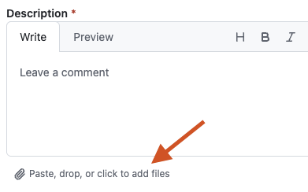

# ExplorADV - Bug Reports

Ce depot permet de signaler des bugs et suggestions pour l'application ExplorADV.

## Comment signaler un probleme

### 1. Allez dans l'onglet **Issues**

### 2. Cliquez sur le bouton **New issue**

### 3. Selectionnez le type de formulaire:
   - **Bug Report** pour signaler un probleme
   - **Suggestion** pour proposer une amelioration

Certains champs du formulaire sont communs à tous les formulaires:

- **Description** (obligatoire): Brève description du problème ou de la suggestion

- **Appareil**: Votre modele d'appareil (ex: iPhone 14 Pro)

- **Version iOS**: Votre version iOS (ex: 17.5)

Selon votre sélection, vous aurez des champs supplémentaires à saisir.

1. **Bug Report**:

- **Etapes pour reproduire**: Les etapes pour reproduire le bug

2. **Suggestion d'amélioration**:

- **Cas d'utilisation**: Dans quel contexte cette fonctionnalite serait utile

> [!NOTE]
> Vous pouvez televerser des fichiers dans les champs de saisie multiligne. Cliquez sur le lien "Paste, drop, or click to add files" sous le champ.

### 4. Remplissez le formulaire et cliquez sur **Create**

