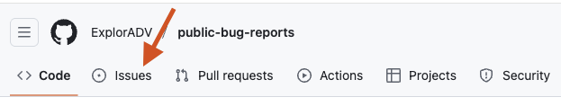
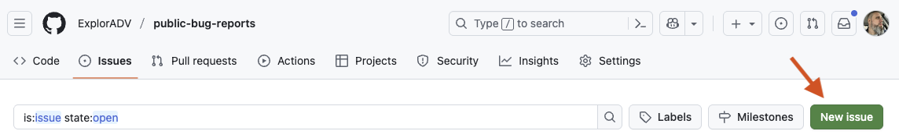
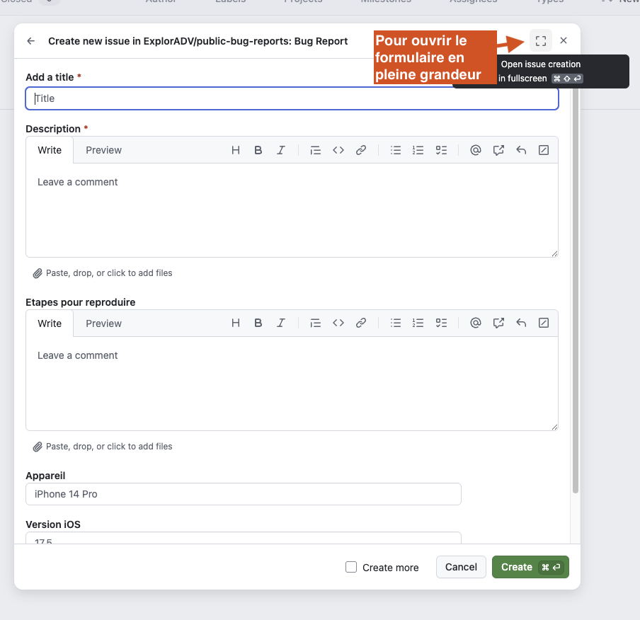

# ExplorADV - Bug Reports

Ce depot permet de signaler des bugs et suggestions pour l'application ExplorADV.

## Comment signaler un probleme

1. Allez dans l'onglet **Issues**

2. Cliquez sur le bouton **New issue**

3. Selectionnez le type de formulaire:
   - **Bug Report** pour signaler un probleme
   - **Suggestion** pour proposer une amelioration

4. Remplissez le formulaire et cliquez sur **Create**

## Bug Report

Utilisez ce formulaire pour signaler un probleme dans l'application.

Champs:
- **Description** (obligatoire): Decrivez le probleme rencontre
- **Etapes pour reproduire**: Les etapes pour reproduire le bug
- **Appareil**: Votre modele d'appareil (ex: iPhone 14 Pro)
- **Version iOS**: Votre version iOS (ex: 17.5)

## Suggestion

Utilisez ce formulaire pour proposer une amelioration ou une nouvelle fonctionnalite.

Champs:
- **Description** (obligatoire): Decrivez votre suggestion
- **Cas d'utilisation**: Dans quel contexte cette fonctionnalite serait utile
- **Appareil**: Votre modele d'appareil
- **Version iOS**: Votre version iOS